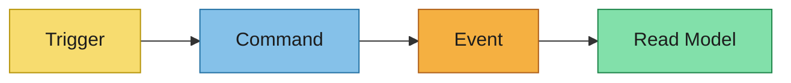
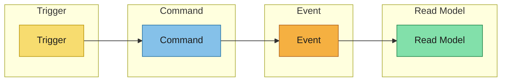

# Event Modeling

将 event-storming 输出转换为明确的行为流。

对每个场景使用以下泳道顺序：
`Trigger -> Command -> Event -> Read Model`

## Scenario Overview
- 场景：
- 业务目标：
- 来自 `event-storming.md` 的源引用：

## Swim Lanes

### Trigger
- 人类/系统触发器：
- 输入信号：

### Command
- 命令名称：
- 目标聚合/上下文：
- 验证规则：

### Event
- 事件名称：
- 事件有效负载摘要：
- 排序/幂等性备注：

### Read Model
- 投影或物化视图：
- 消费者：
- 启用的查询/用例：

## Mermaid Flow

## Timeline / Swimlane Diagram

## Derivation Notes for Downstream Artifacts
- Specs 输入（用户故事和验收标准）：
- Design 输入（broker、subject 命名、有效负载格式、安全性）：
- AsyncAPI 输入（channels、messages、bindings、schemas）：