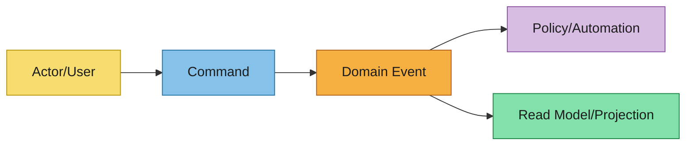

# Event Storming

在正式 spec 之前捕获域的协作发现成果。

## Scope and Goal
- 域/问题领域：
- 期望的业务结果：
- 在范围内/超出范围：

## Actors
- 主要用户：
- 外部系统：
- 自动化代理：

## Domain Events（过去式）
- 事件：
  - 触发器/发生原因：
  - 发出数据：
  - 业务影响：

## Commands
- 命令：
  - 颁发者（actor/system）：
  - 聚合/上下文目标：
  - 先决条件：
  - 期望事件：

## Aggregates / Bounded Contexts
- 聚合/上下文：
  - 职责：
  - 不变量：
  - 拥有的数据：

## Automations / Policies
- 自动化/策略名称：
  - 触发事件：
  - 发出的命令：
  - 失败处理：

## Timeline Diagram（Mermaid）

## Hotspots and Open Questions
- 歧义：
- 风险：
- 需要的决策：

## Handoff to Next Artifacts
总结这些发现应如何告知：
- `event-modeling.md`
- `specs/**/*.md`
- `design.md`
- `asyncapi.yaml`