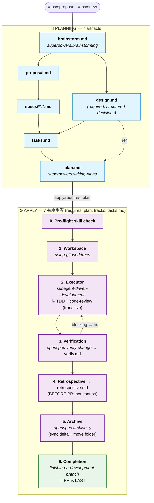

# superpowers-bridge Schema

[English](./README.md) · [繁體中文](./README.zh-TW.md)

[](https://github.com/JiangWay/openspec-schemas/actions/workflows/validate-schemas.yml)
[](https://github.com/JiangWay/openspec-schemas/issues?q=is%3Aopen+label%3Aupstream-version-check)
[](#compatibility)
[](#compatibility)

> 将 [OpenSpec](https://github.com/Fission-AI/OpenSpec) 的 artifact 治理（**做什么**）与 [obra/superpowers](https://github.com/obra/superpowers) 执行技能（**怎么做**）桥接为单一工作流。增加一个证据优先的 `retrospective` artifact，填补 Superpowers 本身未涵盖的空白。
>
> 集成完全位于提示层 — 没有修改 Superpowers 源，没有 OpenSpec CLI 更改。Schema 版本：v1。

---

## 安装

### 方法 1：Claude Code 一键提示（推荐）

将以下内容复制粘贴到项目根目录的 Claude Code 中：

```
Install the superpowers-bridge schema for OpenSpec into this project:

1. Verify the project has an `openspec/` directory (run `openspec init` if missing).
2. Clone https://github.com/JiangWay/openspec-schemas to a temp dir.
3. Copy the `superpowers-bridge/` subdirectory to `openspec/schemas/superpowers-bridge/`.
4. Run `openspec schema validate superpowers-bridge` to verify.
5. Run `openspec schemas` and confirm `superpowers-bridge` is listed.
6. If a CLAUDE.md exists at the project root, ask me whether to insert the workflow-routing fragment from `openspec/schemas/superpowers-bridge/templates/adopters/CLAUDE.md.fragment.<locale>.md` (auto-detect locale from existing CLAUDE.md content; default zh-TW for Traditional Chinese, no suffix for English). If I say yes, append the fragment as a new section. If no CLAUDE.md exists, skip.
7. Clean up the temp directory.
8. Verify Superpowers plugin is installed by running `claude plugin list`.
   If not listed, run `claude plugin install superpowers@claude-plugins-official`.
9. Show me the final state.
```

### 方法 2：手动 bash（CI / 非 Claude 环境）

```bash
git clone https://github.com/JiangWay/openspec-schemas /tmp/oss
cp -R /tmp/oss/superpowers-bridge ~/your-project/openspec/schemas/superpowers-bridge

# Optional: insert workflow-routing fragment into CLAUDE.md
# cat /tmp/oss/superpowers-bridge/templates/adopters/CLAUDE.md.fragment.md       # English
# cat /tmp/oss/superpowers-bridge/templates/adopters/CLAUDE.md.fragment.zh-TW.md # zh-TW

rm -rf /tmp/oss
cd ~/your-project
openspec schema validate superpowers-bridge
claude plugin install superpowers@claude-plugins-official  # if not already
```

---

## 升级现有安装

如果你的项目已有 `openspec/schemas/superpowers-bridge/` 并且想要拉取最新版本，请使用以下升级方法之一。升级会覆盖整个 `superpowers-bridge/` 目录并提供 CLAUDE.md 片段更新 — 见下面的"升级覆盖的内容"。

### 升级方法 1：Claude Code 一键提示（推荐）

在项目根目录，将以下内容粘贴到 Claude Code：

```
Upgrade the superpowers-bridge schema in this project:

1. Verify `openspec/schemas/superpowers-bridge/` already exists (upgrade, not fresh install). If missing, abort and tell me to use the install instructions instead.
2. Clone https://github.com/JiangWay/openspec-schemas to a temp dir.
3. Show me the diff between the local `openspec/schemas/superpowers-bridge/` and the cloned `superpowers-bridge/` (use `diff -ruN`). Wait for my ack before overwriting.
4. After my ack, overwrite the local schema dir with the cloned one.
5. Run `openspec schema validate superpowers-bridge` to verify.
6. Check whether this project has `CLAUDE.md` at the repo root.
   - If yes: scan it for an existing workflow-routing section referencing superpowers-bridge.
     - If found: show me the diff between that section and `superpowers-bridge/templates/adopters/CLAUDE.md.fragment.<locale>.md`. Wait for my ack before replacing.
     - If not found: ask whether to insert the new fragment from `templates/adopters/CLAUDE.md.fragment.<locale>.md`.
   - If no CLAUDE.md exists: skip.
7. Clean up the temp directory.
8. Show me the final state.
```

> `<locale>` 默认 `zh-TW` 如果你的 CLAUDE.md 是繁体中文，或者无后缀（English）。Claude 从现有 CLAUDE.md 内容检测。

### 升级方法 2：手动 bash

```bash
# 1. 获取最新捆绑包
git clone https://github.com/JiangWay/openspec-schemas /tmp/oss-upgrade

# 2. 先审查 diff（不要盲目覆盖）
diff -ruN ~/your-project/openspec/schemas/superpowers-bridge /tmp/oss-upgrade/superpowers-bridge

# 3. 审查后，覆盖
rm -rf ~/your-project/openspec/schemas/superpowers-bridge
cp -R /tmp/oss-upgrade/superpowers-bridge ~/your-project/openspec/schemas/superpowers-bridge

# 4. 验证
cd ~/your-project && openspec schema validate superpowers-bridge

# 5. CLAUDE.md 片段（手动）
# View /tmp/oss-upgrade/superpowers-bridge/templates/adopters/CLAUDE.md.fragment.md
# Compare against your CLAUDE.md and insert/update the corresponding section as needed

# 6. 清理
rm -rf /tmp/oss-upgrade
```

### 升级覆盖的内容

| 路径 | 操作 | 手动步骤？ |
|---|---|---|
| `openspec/schemas/superpowers-bridge/` | 自动覆盖 — 整个目录从上游替换（方法 2 中的 `rm -rf` + `cp -R`；方法 1 中的等效操作） | 无 |
| `CLAUDE.md`（项目根） | Schema 目录附带 `templates/adopters/CLAUDE.md.fragment.<locale>.md`；升级过程将你现有的 CLAUDE.md 与此片段进行 diff，并在插入/替换之前等待你的确认 | 是 — 审查 diff，选择插入/替换/保留 |

> 桥接目录是整体的 — 你接受整个新版本或保留旧版本。
没有 per-file 选择加入。CLAUDE.md 是升级触及的唯一项目根文件，并且绝不会未经你的确认就触及。

> 进行中的变更（任何阶段：brainstorm / design / specs / ...）保持有效，因为 Schema 图（`requires:` 边、PRECHECK、artifact 依赖）在 v1.x 中没有更改。升级之前的现有 `verify.md` / `retrospective.md` 仍然可读；如果在其上重新运行 `/opsx:verify` 或 `/opsx:continue → retrospective`，新模板结构在覆盖时应用。

> 如果未来的升级在结构上修改了 Schema 图（artifact 添加/删除、`requires:` 边更改、PRECHECK 更改），README 将获得版本字段和迁移指南。v1 → v1.x 仅散文更改是安全的，不需要迁移。

---

## 这解决了什么问题？

OpenSpec 治理**做什么**（artifact 生命周期：proposal / specs / tasks / verify 等）。Superpowers 治理**怎么做**（执行纪律：头脑风暴、写计划、TDD、代码评审）。每个本身都很扎实；在实际开发中将它们交错会出现三个结构性问题：

1. **输出重复** — 头脑风暴将设计输出写入 `docs/superpowers/specs/`；OpenSpec 在变更目录中重新编写 `proposal.md` / `design.md`，内容重叠。
2. **任务碎片化** — OpenSpec 的 `tasks.md`（粗粒度复选框）和 Superpowers 的 `plan.md`（TDD 微步骤）以不同格式、位置和进度跟踪器描述相同的工作。
3. **手动编排** — 用户必须在每一步决定调用哪个技能；两个系统不会自动连接。

### 为什么是自定义 Schema 而不是修改现有技能？

考虑并拒绝了两种替代方案：

- **向 `config.yaml` 添加自定义字段**（例如 `skill_bindings`）：OpenSpec CLI 不识别它们 — 没有验证，没有可发现性，需要编辑多个 SKILL.md 文件。
- **直接编辑 opsx 技能文件**：侵入性（影响每个变更）且脆弱（SKILL.md 升级时被覆盖）。

自定义 Schema 使用 OpenSpec 的**原生项目级 Schema 机制**：CLI 验证结构，`openspec schemas` 自动列出它，每个变更独立选择其 Schema（`--schema spec-driven` 或 `--schema superpowers-bridge`），并且不修改现有 SKILL.md 或命令文件。

---

## 入口和出口门禁

此 Schema 的指令仅在通过 `/opsx:*` 命令调用时触发。如果你通过叙述触发 Superpowers 技能 — 例如，说"让我们讨论架构" — 默认行为绕过 Schema。头脑风暴仍会写入 `docs/superpowers/specs/`，破坏集成的重定向。

本节涵盖三件事：

1. 何时根本不需要进入 Schema（只需打开 PR）
2. 何时应将口头头脑风暴提升为 opsx 变更
3. 安装 Schema 后要避免的前门反模式

### 何时不进入 Schema（直接 PR）

并非每个变更都需要 `change` 目录。以下情况应完全跳过 opsx：

| 场景 | 需要变更？ | 该怎么做 |
|---|---|---|
| 新功能 / 新能力 | ✅ 是 | `/opsx:new <name> --schema superpowers-bridge` |
| 破坏性变更 | ✅ 是 | 同上 |
| 架构变更 | ✅ 是 | 同上 |
| Bug 修复（恢复预期行为，无契约变更） | ❌ 否 | 直接 PR |
| 测试回填 / 覆盖 | ❌ 否 | 直接 PR |
| 构建工具调整（linter 规则、覆盖率阈值） | ❌ 否 | 直接 PR |
| 非破坏性依赖升级 | ❌ 否 | 直接 PR |
| 文档更新 / 拼写错误修复 | ❌ 否 | 直接 PR |
| 配置值调整（无结构变更） | ❌ 否 | 直接 PR |

> 原则：**流程仪式应与风险成正比**。外部契约、跨系统集成、DB Schema 变更、合规边界 → 运行变更。拼写错误、bug 修复、超时调整 → 直接 PR。对于模糊的情况，请使用下面的 5 条件检查清单。

### 何时应将口头头脑风暴提升为变更

如果 `superpowers:brainstorming` 是通过叙述（"让我们头脑风暴架构"）在使用此 Schema 的项目中触发的，则头脑风暴输出**不得**落在 `docs/superpowers/specs/` 中 — 那会绕过 Schema 的输出重定向并产生孤立 artifact。

正确的流程：口头继续头脑风暴，直到满足下面的所有 5 个条件，然后提升到 `/opsx:propose` 或 `/opsx:new`，以便商定的设计落在 `openspec/changes/<name>/brainstorm.md` 中。

1. **范围锁定** — 一句话描述什么在内/在外，并且范围不会每回合不断增长
2. **主要设计分叉已解决** — 替代方案已被权衡并选择一个；剩余的未知是**显式 TBD**（带所有者和影响范围声明），而不是"还没考虑过"
3. **跨系统依赖已映射** — 对于每个依赖项：就绪 / 可模拟 / 真正未知 — 选择一个
4. **可陈述验收标准** — 具体通过条件（例如 `./mvnw clean verify` 通过 + N 个具体可交付成果）
5. **对话正在收敛** — 最后 1-2 回合是确认，而不是新的"那如果..."分叉

如果缺少任何条件，请继续头脑风暴。当全部五个都满足时：
- 模型**应主动建议**"这看起来已准备好 `/opsx:propose` — 要打开变更吗？"
- 用户**也可以明确说**"将此作为 opsx 变更打开"
- 无论如何，**提升需要明确的人工确认** — 永远不自动

### 前门反模式

| 反模式 | 为什么错 |
| |
| 安装 Schema 后允许头脑风暴写入 `docs/superpowers/specs/` | 绕过 [schema.yaml](./schema.yaml) 第 35-39 行的重定向；产生孤立 artifact |
| 允许 writing-plans 写入 `docs/superpowers/plans/` | 同样的原因（schema.yaml 第 169-171 行） |
| 在未解决的阻塞 TBD 下提升到 opsx | 这些 TBD 也会阻塞 apply 阶段 — 提升只会推迟同样的问题 |
| 为 bug 修复 / 拼写错误 / 配置调整打开变更 | 流程仪式超过实际风险；减慢交付而不增加价值 |

---

## 工作流和集成

### Artifact DAG

```text
brainstorm ──┬──→ proposal ──→ specs ──┐
             │                         ├──→ tasks ──→ plan ──→ [apply] ──→ verify ──→ retrospective
             └──→ design ──────────────┘
```

与 `spec-driven` 的区别：

| | spec-driven | superpowers-bridge |
|---|---|---|
| 入口 | proposal（手动） | **brainstorm**（调用头脑风暴技能） |
| 计划层 | tasks（粗粒度） | tasks + **plan**（TDD 微步骤） |
| apply requires | tasks | **plan** |
| apply 方法 | 标准逐任务 | **worktree + subagent-driven-development**（传递性地带有 TDD + 代码评审） |
| 实施后 | （无） | **verify** + **retrospective** artifact |
| 新增 artifact | — | brainstorm、plan、verify、retrospective |

### 生命周期（apply 编排和时机说明）

上述 Artifact DAG 显示**文件存在**依赖关系。
下面的运行时生命周期增加了 apply 阶段的有序步骤和**时机偏移**在图边和实际生产顺序之间。



ASCII 回退（CLI 可读）：

```text
PLANNING ━━━━━━━━━━━━━━━━━━━━━━━━━━━━━━━━━━━━━━━━━━━━━━━━━━━━━━
  brainstorm.md ──┬─→ proposal.md ──→ specs/**/*.md ──┐
                  │                                   ├─→ tasks.md ──→ plan.md
                  └─→ design.md (required) ───────────┘
                                                                       │
                          apply.requires: [plan], apply.tracks: tasks  ▼
APPLY ━━━━━━━━━━━━━━━━━━━━━━━━━━━━━━━━━━━━━━━━━━━━━━━━━━━━━━━━
  0. Pre-flight skill check
  1. superpowers:using-git-worktrees
  2. superpowers:subagent-driven-development (+ TDD + code-review transitive)
  3. openspec-verify-change → verify.md ◄┐
                              │           │ blocking → fix
                              ▼           │
  4. retrospective.md (BEFORE PR; hot context)
  5. openspec archive -y (sync delta + move folder)
  6. superpowers:finishing-a-development-branch (🏁 PR is LAST)
```

> **时机说明**（完整理由见"六个设计要点" #6）：
> - `verify.md` 在图中声明 `requires: plan`，但实际上是在 apply 步骤 3 中生成的。
> - `retrospective.md` 声明 `requires: verify` 并根据步骤 4 在**打开 PR 之前**生成 — 因此 PR 差异包含完整的归档周期（所有 artifact 完成、spec 已同步、变更文件夹在 `archive/` 下）。
> - `requires:` 边是 OpenSpec 图引擎的文件存在依赖关系；运行时排序存在于指令散文中。

### 七个 Superpowers 接触点

| # | Superpowers 技能 | 调用位置 | 触发器 |
|---|---|---|---|
| 1 | `superpowers:brainstorming` | `brainstorm` artifact 指令 | 直接（带 PRECHECK） |
| 2 | `superpowers:writing-plans` | `plan` artifact 指令 | 直接（带 PRECHECK） |
| 3 | `superpowers:using-git-worktrees` | apply 步骤 1 | 直接 |
| 4 | `superpowers:subagent-driven-development` | apply 步骤 2 | 直接 |
| 5 | `superpowers:test-driven-development` | （在 #4 中激活） | **传递性** |
| 6 | `superpowers:requesting-code-review` | （在 #4 中激活） | **传递性** |
| 7 | `superpowers:finishing-a-development-branch` | apply 步骤 4 | 直接 |

加上一个 OpenSpec 内置：`openspec-verify-change`（apply 步骤 3，生成 `verify.md`）。

> **没有 `executing-plans` 回退。** 此 Schema 有观点：它需要支持子 agent 的平台（Claude Code、Codex 等）。替代执行器 `superpowers:executing-plans` 不会传递性地激活 TDD 或代码评审（根据其 [SKILL.md](https://github.com/obra/superpowers/blob/main/skills/executing-plans/SKILL.md) 验证）— 回退会静默降低 Superpowers 的核心价值。如果你的平台缺乏子 agent 支持，请改用内置的 `spec-driven` Schema。

### 输出重定向

Superpowers 技能有默认输出路径（例如，头脑风暴写入 `docs/superpowers/specs/`）。此 Schema 的 artifact 指令**通过在调用时重定向输出到变更目录的上下文注入来覆盖**该行为：

- brainstorming → `openspec/changes/<name>/brainstorm.md`
- writing-plans → `openspec/changes/<name>/plan.md`

纯粹通过在调用时注入上下文实现，而不是通过修改技能源。

---

## 使用

### 快速流程（推荐）
```bash
/opsx:ff my-feature    # 一键：脚手架 + brainstorm + proposal + design + specs + tasks + plan
/opsx:apply            # worktree + subagent-driven-development（带 TDD + 代码评审）
/opsx:verify           # 生成 verify.md（7 项检查）
/opsx:continue         # → retrospective（生成 retrospective.md，§0 + 6 节）
/opsx:archive          # 归档
```

### 逐步流程
```bash
/opsx:new my-feature --schema superpowers-bridge
/opsx:continue         # → brainstorm（交互式对话）
/opsx:continue         # → proposal
/opsx:continue         # → design（将 brainstorm 重新组织为结构化决策）
/opsx:continue         # → specs
/opsx:continue         # → tasks
/opsx:continue         # → plan
/opsx:apply            # → 实现 + worktree + subagent-driven-development
/opsx:verify           # → verify.md（apply 后，运行 7 项检查）
/opsx:continue         # → retrospective.md（verify 后，证据优先的 §0 + 6 节）
/opsx:archive
```

### 切换回 spec-driven
```bash
# 对一个变更使用不同的 Schema
/opsx:new my-simple-fix --schema spec-driven

# 或在 openspec/config.yaml 中更改项目默认值：schema: spec-driven
```

---

## Apply 阶段演练

`/opsx:apply` 触发 [schema.yaml](./schema.yaml) 的 `apply.instruction` 中的步骤：

#### 0. Pre-flight — 验证所需的 Superpowers 技能

在继续之前确认这些技能已安装：

- `superpowers:using-git-worktrees`
- `superpowers:subagent-driven-development`（传递性地：`test-driven-development`、`requesting-code-review`）
- `superpowers:finishing-a-development-branch`

缺失技能 → **停止**并报告明确的错误。没有静默回退，此 Schema 内无手动模式。用户应安装 Superpowers 或对那次变更切换到内置的 `spec-driven` Schema。

> 此 Schema 的 v0 版本曾在此处放置"自动提交变更 artifact 到当前分支"步骤。它在 [PR #970 审查](https://github.com/Fission-AI/OpenSpec/pull/970) 后被删除：处理未跟踪的变更目录是 worktree 技能的责任，而不是 Schema 的责任。

#### 1. Workspace — `superpowers:using-git-worktrees`

创建 `.worktrees/<change-name>/`，切换到新分支，运行设置，确认干净的测试基线。

#### 2. Executor — `superpowers:subagent-driven-development`

主 agent 读取 `plan.md`，为每个微任务调度新的子 agent。每个子 agent 传递性地激活：

- **TDD**（`superpowers:test-driven-development`）：编写失败的测试 → 观察其失败 → 最少代码 → 通过；在失败测试之前编写的生产代码将被删除
- **每任务代码评审**（`superpowers:requesting-code-review`）：spec 合规性评审 + 代码质量评审；关键问题阻塞前进

粗粒度的 `tasks.md` 复选框随任务完成而勾选。在所有任务之后，最终的代码评审覆盖整个实现。

此 Schema 不支持 `superpowers:executing-plans` 作为回退。请参阅下面的"六个设计要点"部分以了解原因。

#### 3. Verification — `openspec-verify-change`

通过 7 项检查生成 `verify.md`：结构验证（`openspec validate --all --json`）、任务完成、delta-spec 同步状态、design/specs 一致性（非阻塞警告）、实施信号（已提交代码）、前门路由泄漏检测器（非阻塞警告）、延迟 dogfood 与自动化测试等价性。最后一项检查仅在 `plan.md` 有 `[~]` 延迟但等价部分为空时阻塞（缺口分析被跳过）；否则它是信息性的。

失败路由回相应的 artifact 进行修复；verify 可以重新运行。

> **步骤 4–6 是规范的后续验证序列：retro → archive → PR。重新排序会产生不完整的 PR（回顾 + 归档作为合并后的尾部提交落下来，失去热上下文）。**

#### 4. Retrospective — `retrospective` artifact（推荐；根据入口和出口门禁跳过规则，微小修复可以跳过）

证据优先的反思：§0 Evidence（量化前置事项 — 提交计数、差异大小、任务完成率、依赖项、validate 状态等）加上 6 个分析部分（Wins / Misses / Plan deviations / Skill compliance / Surprises / Promote candidates）。每个声明都引用提交/文件/可衡量事实，通常引用 §0 而不是每行内联证据。该过程嵌入在 artifact 的指令中 — 无需外部技能（设计规范中的决策 3 将 Claude Code 插件打包推迟到 v1.x）。

在打开 PR **之前**编写，以便 retro 落在同一 PR 差异中。

#### 5. Archive — `openspec archive -y`（或 `/opsx:archive`）

将 delta specs 同步到 `openspec/specs/<capability>/spec.md` 并将变更文件夹移动到 `openspec/changes/archive/YYYY-MM-DD-<name>/`。在 PR 打开之前**运行**，以便差异反映完整的归档周期（所有 artifact 完成、spec 已同步、文件夹在 archive/ 下）。

#### 6. Completion — `superpowers:finishing-a-development-branch`

确认测试为绿色，呈现合并/PR/保留分支/放弃选项，清理 worktree。**PR 是最后一步** — 如果 retro 或 archive 尚未完成，请先完成它们。

---

## CLI 备忘单

| 场景 | 命令 |
|---|---|
| 项目的首次克隆 | `bash scripts/install-git-hooks.sh` |
| 新变更（交互式） | `/opsx:new <name> --schema superpowers-bridge` 然后 `/opsx:continue` |
| 新变更（一键） | `/opsx:ff <name>` |
| 恢复中断的变更 | `/opsx:continue <name>` |
| 进入实现 | `/opsx:apply <name>` |
| 手动 verify | `/opsx:verify <name>` |
| 归档 | `/opsx:archive <name>` |
| 使用内置（跳过 brainstorm） | `/opsx:new <name> --schema spec-driven` |
| 列出项目中的所有 Schema | `openspec schemas` |
| 检查变更的进度 | `openspec status --change <name> --json` |
| 列出活动变更 | `openspec list` |
| 验证整个项目 | `openspec validate --all --json` |

---

## 值得记住的六个设计要点

### 1. 技能名称 PRECHECK（第 1 层能力检测）

调用 Superpowers 技能的每个 artifact / apply 步骤在其指令开头运行 PRECHECK，确认该技能存在于 LLM 的可用技能列表中。**缺失技能 = 停止，无静默回退。** 这是 [PR #970 审查](https://github.com/Fission-AI/OpenSpec/pull/970) 关注点 #1 的具体答案 — 大声失败，早期失败。

### 2. Schema 级与提示级集成

集成完全存在于 `instruction:` 字段（纯提示）中。如果 Superpowers 升级技能的行为，则 Schema 不变。我们仅在技能被重命名或删除时触及 `schema.yaml`。

### 3. 传递性依赖被明确化

TDD 和代码评审通常隐藏在 `subagent-driven-development` 的 SKILL.md 中。我们 Schema 的 apply 步骤 2a 指令明确列出了这两个传递性激活，以便读者可以一目了然地看到"apply 期间实际发生了什么"。

### 4. 有观点：仅子 agent 平台，无手动回退

此 Schema 需要支持子 agent 的平台（Claude Code、Codex 等）。替代执行器 `superpowers:executing-plans` 不会传递性地激活 TDD 或代码评审（根据其 [SKILL.md](https://github.com/obra/superpowers/blob/main/skills/executing-plans/SKILL.md) 验证 — 其主体未提及任一，其 Integration 部分省略了 `test-driven-development` 和 `requesting-code-review`）。回退到它会静默丢失 Superpowers 为此集成带来的价值。我们更喜欢在步骤 0 大声失败，并指导用户改用内置的 `spec-driven` Schema。

### 5. verify 和 retrospective 的基于证据的预CHECK（第 2 层能力检测）

每个时机敏感的 artifact 在其指令开头运行具体的 shell 证据检查：

- **verify**：`git log <base>..HEAD | wc -l > 0` AND `grep -c '^- \[x\]' tasks.md > 0`
- **retrospective**：`test -f verify.md` AND `! grep -q '^- \[x\] ❌ FAIL' verify.md`

LLM 不需要解释时机散文 — 它运行命令并读取结果。这是关注点 #1 的第 2 层 / 关注点 #2 的缓解。

### 6. verify 和 retrospective 是时机不匹配的 artifact（已知限制）

`verify.requires: [plan]` 和 `retrospective.requires: [verify]` 是 Schema 图中的文件存在依赖关系，但每个指令明确声明"必须在 apply 阶段/验证通过后运行"。这是有意的不对齐 — OpenSpec 的引擎仅检查前置文件存在。引擎原生修复等待上游的 `post_apply` 阶段概念（类似于 spec-kit 的 `after_implement` 钩子）；上面的基于证据的 PRECHECK 是 v1 缓解。

---

## 版本控制

此捆绑包带有**不应混淆的两个版本标识符**：

| 标识符 | 位置 | 含义 | 示例 |
|---|---|---|---|
| Schema 主版本 | `schema.yaml: version: 1` | Schema 图的契约（artifact、`requires:` 边、PRECHECK 形状）。破坏性更改会增加此版本。 | `1` |
| 捆绑包发布 | `VERSION` 文件 + git 标签 | 此捆绑包的 SemVer 发布，限定于 Schema 主版本。 | `1.0.0`（标记为 `v1.0.0`） |

捆绑包发布 `1.x.y` 是 Schema 主版本 `v1` 的已发布切片。未来的 Schema 主版本 `v2` 将从 `2.0.0` 重新启动捆绑包发布。固定到 `v1.x.y` 的采纳者保证在 v1 主版本内的 schema-graph 兼容性。

> 下面的兼容性矩阵使用 `v1`（Schema 主版本）作为行键，因为与 OpenSpec/Superpowers 的兼容性由 Schema 契约治理，而不是由本捆绑包内的补丁级编辑。

## 兼容性

撰写此 Schema 所基于的基线版本。这是**历史快照，不是端到端兼容性保证** — CI 无法在无头模式下运行完整的提示层工作流，因此行为兼容性依赖于漂移触发时的人工审查。

当前捆绑包发布：**`1.0.0`**（git 标签 `v1.0.0`；见 [VERSION](./VERSION)）。

| superpowers-bridge | OpenSpec CLI | Superpowers 插件 | 截至基线 |
|---|---|---|---|
| v1 | `1.4.1` | `v5.1.0` | 2026-06-10 |

### 这是如何检查的

契约是三层 — **基线声明 + 自动化漂移检测 + 人工审查** — 不是自动化兼容性强制。

| 层 | 机制 | 捕获 | 触发时机 |
|---|---|---|---|
| 结构 | 每次推送/PR 上的 [`validate-schemas.yml`](../.github/workflows/validate-schemas.yml)；每周针对最新 OpenSpec 的 [`version-check.yml`](../.github/workflows/version-check.yml) | Schema-graph 破坏（字段重命名、移除的 `requires:` 边、PRECHECK 语法更改） | CI 运行失败红色 |
| 漂移通知 | 每周 [`version-check.yml`](../.github/workflows/version-check.yml)，将上述基线与最新 npm/GitHub 发布进行比较 | 已固定 ≠ latest upstream | 打开/更新[标记的漂移问题](https://github.com/JiangWay/openspec-schemas/issues?q=is%3Aopen+label%3Aupstream-version-check)以供人工审查（工作流保持绿色 — 漂移是正常的，不是失败） |
| 端到端工作流 | **不自动化** | Superpowers 技能内的行为更改（重命名、改变 PRECHECK 语义的散文重写、传递性依赖更改）；微妙的 OpenSpec 引擎语义转变 | 当漂移问题触发时，人工阅读上游发布说明 |

"截至基线"日期在维护者手动针对列出的版本重新运行完整周期并确认没有任何降级时增加。在此之前，日期标记人工证明，而不是自动化测试通过。

### 已知破坏性更改

迄今为止没有。未来的 Schema-graph 结构更改（artifact 添加/删除、`requires:` 边更改、PRECHECK 更改）将在此处列出，并附迁移说明。

对于采纳者：固定到上述版本或更高版本。要检查你自己项目的运行时状态，请运行 `openspec list` + `openspec schemas` + `claude plugin list`。

---

## 值得了解的设计决策

### 为什么 `brainstorm` 是 artifact，而不是钩子

头脑风暴是需要用户参与的多回合交互式对话。将其建模为第一个 artifact（而不是 Schema 级钩子）有两个优点：

1. **可跳过** — 如果用户已经知道要构建什么，他们可以直接编写 `brainstorm.md` 而无需调用该技能。
2. **可追踪** — `openspec status` 报告头脑风暴完成情况，下游 artifact 对其有明确的依赖关系。

### 为什么 `plan` 与 `tasks` 分开

`tasks.md` 是粗粒度复选框（"Add PdfServiceTest"）；`plan.md` 是微步骤（"scaffold test → write downloadPdf test → run → commit"）。它们有不同的用途：

- `tasks.md` → 跟踪整体进度（apply 阶段的 `tracks` 字段解析这些复选框）
- `plan.md` → 逐步指导子 agent（执行器的输入）

Apply 需要 `plan`（而不是 `tasks`），因为执行器需要微步骤；`tracks: tasks.md` 确保进度仍然通过粗粒度复选框显示。

### 回退策略

如果 Superpowers 技能不可用：

- **`brainstorm` / `plan` artifact** — 用户可以明确选择手动编写 artifact（PRECHECK 停止并通知用户；手动覆盖需要有意的人工操作，而不是静默降级）
- **`apply` 阶段** — 此 Schema 内无手动回退。如果任何所需技能缺失，PRECHECK 在步骤 0 停止。推荐路径是对该变更切换到内置的 `spec-driven` Schema。原因：见上面的设计要点 #4 — `executing-plans` 不会传递性地激活 TDD 或代码评审，降级的 apply 阶段会违背 Schema 的目的。

---

## 相关

- [schema.yaml](./schema.yaml) — 机器可读的 Schema 定义
- [templates/](./templates/) — 每个 artifact 的 markdown 模板
- [README.zh-TW.md](./README.zh-TW.md) — 繁體中文版
- [obra/superpowers](https://github.com/obra/superpowers) — Superpowers 技能源
- [Fission-AI/OpenSpec](https://github.com/Fission-AI/OpenSpec) — OpenSpec
- [OpenSpec PR #970](https://github.com/Fission-AI/OpenSpec/pull/970) — 驱动此设计的原始审查线程